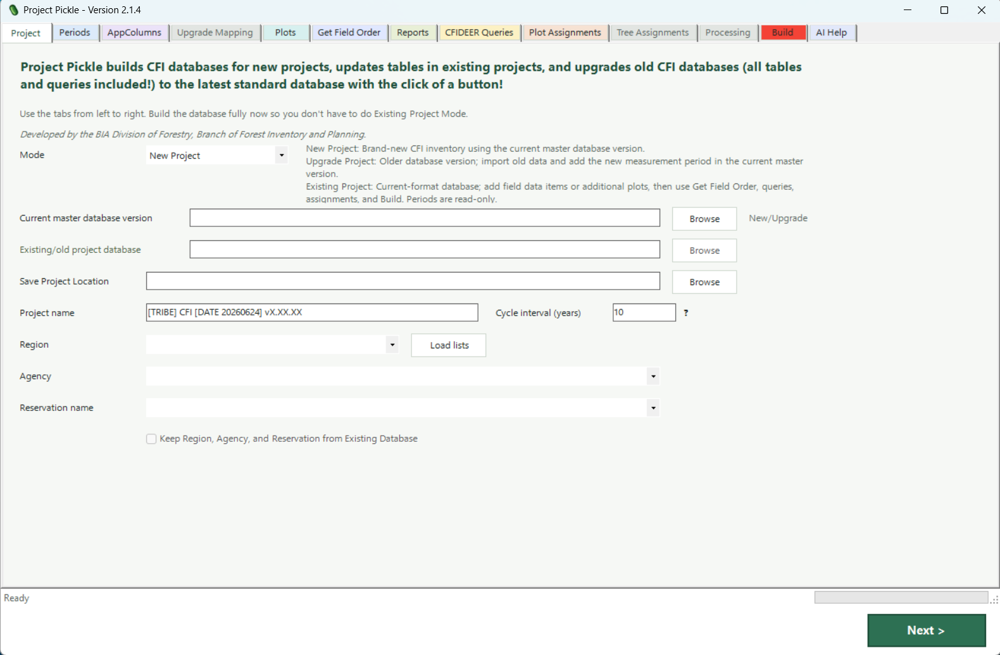

# Project Pickle

Project Pickle is a Windows desktop utility for building new CFI Microsoft Access project databases, updating current-format project databases, and upgrading older project databases into the current standard structure.

<p align="center">
  <a href="docs/images/project-pickle-main.png">
    
  </a>
</p>

<p align="center"><em>Project Pickle 2.1.4 - Project setup screen</em></p>

**Current application version:** `2.1.4`

Project Pickle presents the setup workflow from left to right, validates required information, and performs build work on an output copy rather than intentionally writing to the selected source database.

## What Project Pickle Does

- Supports **New Project**, **Upgrade Project**, and **Existing Project** workflows.
- Sets project, Region, Agency, Reservation, and measurement-period information.
- Reviews standard AppColumns and adds project-specific custom AppColumns and code lists.
- Creates `AppColumnsArchive` from the output copy's original AppColumns setup before changing working AppColumns.
- In Upgrade Project mode, can independently archive the old database's `AppColumns` and `AppColumnCodes` as `zAppColumns` and `zAppColumnsCodes`.
- The `z` archive option is checked by default in Upgrade Project mode and does not replace or change the working AppColumns tables.
- Can completely replace working `AppColumns` and `AppColumnCodes` from an existing database during Upgrade Project or Existing Project work.
- Maps legacy plot, tree, and regeneration fields during database upgrades.
- Imports old plot, tree, regeneration, and assignment data during an upgrade.
- Imports new plots from `.csv`, `.xlsx`, or `.xlsm` files.
- Controls CFIDEER Get-query field order and rebuilds CFIDEER Get/Update queries.
- In Upgrade Project mode, can copy saved `_prjCFIDEER_` query definitions from the old database instead of rebuilding them.
- Designs report layouts or carries completed `ReportHeaders` and `ReportColumns` forward during an upgrade.
- Protects `TreeMeasurements.RemarksTree` as `TEXT,40,5`.
- Automatically adds a trailing separator after the final eligible custom Plot, Tree, or Regen report field immediately before the required Remarks field.
- Rebuilds plot assignments and optional upgrade-only tree assignments.
- Provides an upgrade-only Processing tab with two independent import options:
  - Replace the four Processing setup tables when the old `SpeciesMerchantabilityStandards` structure is compatible.
  - When the merchantability table or required merchantability fields are missing, replace only `SpeciesNationalVolumeParms`, `SpeciesRegressionCriteria`, and `SpeciesRegressions` while retaining `SpeciesMerchantabilityStandards` from the current master database version.
  - Independently replace `PlotSummaries`, `TreeCalculations`, and `RegenCalculations`.
- Stops the first Processing import when any of the three non-merchantability setup tables is missing because those tables cannot be skipped.
- Writes detailed success or failure run logs for review and troubleshooting.
- Includes optional AI Help for Project Pickle setup questions.

## Choose the Correct Mode

| Mode | Use it when | Required database input |
| --- | --- | --- |
| **New Project** | The project has no previous project database. | Current master database version |
| **Upgrade Project** | An older database must be moved into the current structure, or a new remeasurement period is being prepared as part of an upgrade. | Current master database version and old project database |
| **Existing Project** | The database is already in the current structure and needs fields, plots, reports, queries, assignments, validation, or other setup refreshed. | Current-format project database |

## Requirements

Project Pickle is designed for the following environment:

- Microsoft Windows
- Windows PowerShell and Windows Forms
- Microsoft Access `.mdb` or `.accdb` databases
- A compatible Microsoft Access Database Engine, ACE OLE DB provider, or Jet provider
- Read access to input databases and write access to the selected output folder

The included 32-bit launcher is intended for computers where the installed Access database provider is 32-bit. Keep the root launchers and the complete `Project Pickle App Files` support folder together because the launchers use relative paths.

Document the exact Windows, Microsoft Access, and Access Database Engine versions used for release testing before publishing a production release.

## Download and Run

Download the latest release ZIP, extract the complete folder, and run the app from the extracted folder. Do not run Project Pickle from inside a ZIP file.

1. Open the extracted Project Pickle folder.
2. Double-click `Run Project Pickle.vbs`.
3. Choose the correct mode on the Project tab.
4. Complete the needed tabs from left to right.
5. Review the Build tab and the detailed run log before using the output database.

For startup or Access-provider troubleshooting, run:

```text
Run-ProjectPickle-32bit.bat
```

The files inside `Project Pickle App Files` support the root launchers. Regular users should not start `ProjectPickle.ps1` directly.

> Before release, make the launcher name identical in the root README, the HTML how-to guide, and the release package. The current folder shown for version 2.1.4 uses `Run Project Pickle.vbs`.

## Workflow

Version 2.1.4 uses this tab order:

```text
Project -> Periods -> AppColumns -> Upgrade Mapping -> Plots
        -> Get Field Order -> Reports -> CFIDEER Queries
        -> Plot Assignments -> Tree Assignments -> Processing
        -> Build -> AI Help
```

The Processing tab uses a pink accent and the Build tab uses a red accent so the two final workflow areas are easy to locate. These colors do not change database behavior.

Some tabs are mode-specific. `Upgrade Mapping`, `Tree Assignments`, and `Processing` are available only in Upgrade Project mode. `Periods` is read-only in Existing Project mode.

## Upgrade Archive and Copy Options

Project Pickle includes one reference-archive option and several complete-copy options. The archive option preserves old setup rows under new `z` table names. The complete-copy options replace working target table or query sets in the output; they are not selective row merges.

| Option | Available mode | Behavior |
| --- | --- | --- |
| Archive old AppColumns and AppColumnCodes as zAppColumns and zAppColumnsCodes | Upgrade Project | Checked by default. Creates reference snapshots of the old database's AppColumns setup. It does not replace or change working `AppColumns` or `AppColumnCodes`. |
| Copy AppColumns from existing database | Upgrade Project and Existing Project | Replaces working output `AppColumns` and `AppColumnCodes`, then creates missing physical custom measurement fields required by the copied setup. |
| Copy completed ReportHeaders and ReportColumns | Upgrade Project | Replaces the complete output report-table contents with the completed report setup from the old database. |
| Import Processing tables from existing database | Upgrade Project | Copies all four setup tables when merchantability is compatible. When `SpeciesMerchantabilityStandards` or one of its required fields is missing, copies only `SpeciesNationalVolumeParms`, `SpeciesRegressionCriteria`, and `SpeciesRegressions` and leaves merchantability inherited from the current master. |
| Import Plot Summaries, Tree Calc, and Regen Calc tables | Upgrade Project | Independently replaces `PlotSummaries`, `TreeCalculations`, and `RegenCalculations`. |
| Copy existing `_prjCFIDEER_` queries from old database | Upgrade Project | Copies saved `_prjCFIDEER_` query definitions from the old database, disables Get Field Order controls, and turns off CFIDEER query rebuilding for that build. |

The old AppColumns archive option and working AppColumns copy option are independent. An upgrade can archive the old setup without replacing the working setup, perform both operations, or perform neither operation.

`AppColumnsArchive` and the two `z` tables preserve different states:

- `AppColumnsArchive` preserves the AppColumns setup originally present in the output copy's base database.
- `zAppColumns` preserves the old project database's AppColumns rows.
- `zAppColumnsCodes` preserves the old project database's AppColumnCodes rows.

The two Processing checkboxes are also independent. Either one can be selected by itself, both can be selected, or both can remain off.

For the first Processing option:

- A compatible source copies all four setup tables.
- A missing `SpeciesMerchantabilityStandards` table or missing `HasDRC`, `DMsusceptible`, or `DMcollected` triggers a warning and a three-table fallback.
- The fallback replaces `SpeciesNationalVolumeParms`, `SpeciesRegressionCriteria`, and `SpeciesRegressions`.
- The fallback leaves `SpeciesMerchantabilityStandards` inherited from the current master database version.
- Users must manually review and recreate any old project-specific merchantability standards that remain necessary.
- If any of the three fallback tables is missing, the Processing setup import stops because those tables cannot be skipped.

## Repository Layout

```text
ProjectPickle/
|-- README.md
|-- Run Project Pickle.vbs
|-- Run-ProjectPickle-32bit.bat
|-- docs/
    |-- Project Pickle How-To Guide.html
|   |-- TECHNICAL-NOTES.md
|   `-- images/
|       `-- project-pickle-main.png
`-- Project Pickle App Files/
    |-- AI-HELP-CONTEXT.md
    |-- ProjectPickle.ps1
    |-- ProjectPickle.vbs
    |-- Run-ProjectPickle-32bit.bat
    `-- ProjectPickle.ico
```

Do not commit generated run logs, crash logs, real project databases, credentials, private notes, or unsanitized project data.

## Documentation

- [Project Pickle How-To Guide](Project%20Pickle%20How-To%20Guide.html) - detailed operator instructions for every tab and common workflow
- [Technical Notes](docs/TECHNICAL-NOTES.md) - architecture, database behavior, AI Help, testing, and release maintenance
- `Project Pickle App Files/AI-HELP-CONTEXT.md` - focused context used automatically by the in-app AI Help feature

GitHub normally displays an HTML file as source rather than as a rendered web page. Download the how-to guide and open it locally in a browser for the formatted version.

## Data Safety

Project Pickle validates that the output path differs from the selected input database, creates or replaces an output copy, and moves an existing output file to a timestamped backup before replacement. These safeguards do not replace normal database backup and review procedures.

> `zAppColumns` and `zAppColumnsCodes` are reference snapshots; they do not replace the working AppColumns setup. The working AppColumns copy, completed Reports copy, Processing copies, calculated/summary-table copy, and existing CFIDEER query copy are replacements rather than merges. Confirm that the selected old database contains the complete working setup that should replace the corresponding current-master setup. During the Processing three-table fallback, only the three compatible tables are replaced and `SpeciesMerchantabilityStandards` remains inherited from the current master database version. Before selecting AppColumns, completed Reports, Processing, calculated/summary tables, or existing CFIDEER query copy, confirm that the selected old database contains the complete setup that should replace the current master database version's setup.

Before production use:

- Keep an independent backup of every important source database.
- Use an output filename that clearly differs from every input filename.
- Do not overwrite a production database until the output has been reviewed.
- Review the Build tab and the detailed text run log after every build.
- Open the resulting Access database and verify project, period, field, report, query, and assignment records.

## Run Logs and Troubleshooting

Project Pickle writes a detailed text run log beside the selected output database. The filename identifies the outcome, for example:

```text
ProjectName.ProjectPickleRunLog.Success.20260608_123456.txt
ProjectName.ProjectPickleRunLog.Failed.20260608_123456.txt
```

When requesting support, provide the Project Pickle version, selected mode, a screenshot of the error, the step being performed, and the last relevant lines of a sanitized run log.

Do not publish project databases, API keys, personal information, internal paths, or unsanitized logs in a public GitHub issue.

## AI Help and Data Use

AI Help is optional and does not modify the database. It can send the following information to the configured organization-approved Azure OpenAI endpoint:

- The user's question
- The bundled `AI-HELP-CONTEXT.md`
- Relevant snippets from `ProjectPickle.ps1` when code context is enabled
- Relevant snippets from an optional guide or reference file selected by the user

The API key is entered at run time and is not intended to be saved by Project Pickle. Follow organizational policy and do not submit credentials, sensitive project data, or information that is not approved for the configured service.

Review organization-specific endpoint names and deployment settings before publishing the source code publicly.

## Development and Testing

The main application source is:

```text
Project Pickle App Files/ProjectPickle.ps1
```

Run the built-in core self-test from the project root with:

```powershell
.\Run-ProjectPickle-32bit.bat -SelfTest
```

Release testing should also include a clean extracted package or clean Git clone, startup through both root launchers, an AI Help context test, and representative New, Upgrade, and Existing Project builds using non-production test databases.

## Contributing

Use focused commits and keep behavioral changes separate from documentation-only changes. For database or query changes, describe the affected mode, tables, queries, test database shape, expected row counts, and verification steps in the pull request.

Never add real project databases or unsanitized logs to a branch or pull request.

## Author and Attribution

Developed by the **BIA Division of Forestry, Branch of Forest Inventory and Planning**.

**Author:** Christopher LaCroix

## License

Add an organization-approved `LICENSE` file before describing the repository as open source or making a public release. Until a license is approved and included, repository visibility alone does not grant general reuse permission.
