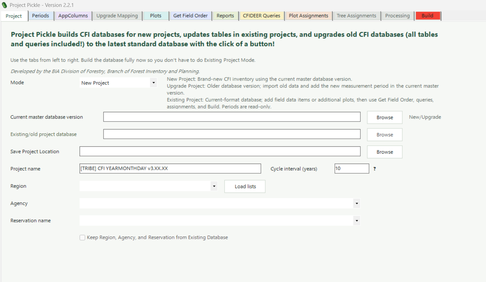

# Project Pickle

Project Pickle is a Windows desktop utility for building new CFI Microsoft Access project databases, updating current-format project databases, and upgrading older project databases into the current standard structure.

<p align="center">
  <a href="docs/images/project-pickle-main.png">
    
  </a>
</p>

<p align="center"><em>Project Pickle 2.2.1 - Project setup screen</em></p>

**Current application version:** `2.2.1`

Project Pickle presents the setup workflow from left to right, validates required information, and performs build work on an output copy rather than intentionally writing to the selected source database.

## What Project Pickle Does

- Supports **New Project**, **Upgrade Project**, and **Existing Project** workflows.
- Sets project, Region, Agency, Reservation, and measurement-period information.
- Writes and verifies the Microsoft Access Application Title from the Project name in New Project and Upgrade Project modes.
- Preserves the existing Access Application Title in Existing Project mode.
- Filters editable standard and custom fields in Get Field Order and rebuilt CFIDEER Get/Update field lists by current **Active + QueryVisible** settings.
- Keeps required query identifiers, relationship and criteria fields, measurement keys, Remarks fields, and audit fields protected where each query requires them.
- Reviews standard AppColumns and adds project-specific custom AppColumns and code lists.
- Creates `AppColumnsArchive` from the output copy's original AppColumns setup before changing working AppColumns.
- In Upgrade Project mode, can independently archive the old database's `AppColumns` and `AppColumnCodes` as `zAppColumns` and `zAppColumnsCodes`.
- Can completely replace the working `AppColumns` and usable `AppColumnCodes` metadata from an existing database.
- Copies only source-backed physical custom fields when AppColumns copy mode is selected.
- Leaves inactive catalog-only AppColumns rows as metadata-only instead of creating unwanted physical fields.
- Preserves the Existing/old Design View field order for `PlotCustomMeasurements`, `TreeCustomMeasurements`, and `RegenCustomMeasurements` when AppColumns copy mode is selected.
- Preserves nonblank Access table and field Description properties during upgrades.
- Requires a complete Upgrade Mapping review when old source-only fields need to be preserved, moved, renamed, or intentionally skipped.
- Performs a source inventory preflight before copying the output database.
- Blocks blank or duplicate record IDs, mismatched measurement/custom row counts, missing or orphan custom rows, and invalid PlotID or TreeID parent relationships.
- Allows valid repeated `RegenMeasKey` values and matched-ID Regen key differences only after explicit user review.
- Imports old plot, tree, regeneration, assignment, Processing, calculation, and summary data during an upgrade.
- Imports new plots from `.csv`, `.xlsx`, or `.xlsm` files.
- Designs report layouts or carries completed `ReportHeaders` and `ReportColumns` forward during an upgrade.
- Protects `TreeMeasurements.RemarksTree` as `TEXT,40,5`.
- Automatically adds a trailing separator after the final eligible custom Plot, Tree, or Regen report field immediately before the required Remarks field.
- Rebuilds plot assignments and optional upgrade-only tree assignments.
- Provides an upgrade-only Processing tab with two independent import options:
  - Replace the four Processing setup tables when the old `SpeciesMerchantabilityStandards` structure is compatible.
  - When the merchantability table or required merchantability fields are missing, replace only `SpeciesNationalVolumeParms`, `SpeciesRegressionCriteria`, and `SpeciesRegressions` while retaining `SpeciesMerchantabilityStandards` from the current master database version.
  - Independently replace `PlotSummaries`, `TreeCalculations`, and `RegenCalculations`.
- Normalizes available `SpeciesMerchantabilityStandards.ProjectID` and `BIAProjectID` values to the current project and verifies every row.
- Requires every Upgrade build to either copy the old `_prjCFIDEER_` queries or rebuild the queries.
- Verifies copied or rebuilt query definitions before a database can be marked successful.
- Rejects `FieldNameSampleRemove`, Access-generated `Exp1`/`Expr1`-style fields, missing required relationship fields, and missing expected active custom fields.
- Writes detailed success or failure run logs for review and troubleshooting.
- Includes optional AI Help for Project Pickle setup questions.

## Choose the Correct Mode

| Mode | Use it when | Required database input |
| --- | --- | --- |
| **New Project** | The project has no previous project database. | Current master database version |
| **Upgrade Project** | An older database must be moved into the current structure, or a new remeasurement period is being prepared as part of an upgrade. | Current master database version and old project database |
| **Existing Project** | The database is already in the current structure and needs fields, plots, reports, queries, assignments, validation, or other setup refreshed. | Current-format project database |

## Requirements

Project Pickle is designed for the following environment:

- Microsoft Windows
- Windows PowerShell and Windows Forms
- Microsoft Access `.mdb` or `.accdb` databases
- A compatible Microsoft Access Database Engine, ACE OLE DB provider, or Jet provider
- Read access to input databases and write access to the selected output folder

The included 32-bit launcher is intended for computers where the installed Access database provider is 32-bit. Keep the root launchers and the complete `Project Pickle App Files` support folder together because the launchers use relative paths.

Large Upgrade builds can take several hours when the project contains large Tree measurement and custom-measurement tables. For the best performance, save the active build to a local non-synchronized folder and copy the completed verified database to OneDrive or another synchronized folder afterward.

Document the exact Windows, Microsoft Access, Access Database Engine, database format, and process-bitness combinations used for release testing before publishing a production release.

## Download and Run

Download the latest release ZIP, extract the complete folder, and run the app from the extracted folder. Do not run Project Pickle from inside a ZIP file.

1. Open the extracted Project Pickle folder.
2. Double-click `Run Project Pickle.vbs`.
3. The wiggling-pickle splash appears while the application loads.
4. The splash closes automatically when the main Project Pickle window is ready.
5. Choose the correct mode on the Project tab.
6. Complete the needed tabs from left to right.
7. Review the Build tab and detailed run log before using the output database.

The root launcher uses a relative path to start:

```text
Project Pickle App Files\ProjectPickle.vbs
```

## Workflow

Version 2.2.1 uses this tab order:

```text
Project -> Periods -> AppColumns -> Upgrade Mapping -> Plots
        -> Get Field Order -> Reports -> CFIDEER Queries
        -> Plot Assignments -> Tree Assignments -> Processing
        -> Build -> AI Help
```

The Processing tab uses a pink accent and the Build tab uses a red accent so the two final workflow areas are easy to locate. These colors do not change database behavior.

Some tabs are mode-specific. `Upgrade Mapping`, `Tree Assignments`, and `Processing` are available only in Upgrade Project mode. `Periods` is read-only in Existing Project mode.

## Upgrade Safety Checks

Before an Upgrade build begins, Project Pickle reviews the Existing/old database and blocks unsafe inventory conditions.

Blocking conditions include:

- Blank or duplicate `PlotID`, `TreeID`, or `MeasurementID`
- `Trees.PlotID` values without a matching `Plots.PlotID`
- Measurement rows without their required parent Plot or Tree
- Different row counts between a measurement table and its custom measurement table
- A measurement row without a matching custom row by `MeasurementID`
- An orphan custom row without a matching measurement row
- Plot or Tree measurement-key disagreement on rows already matched by `MeasurementID`
- A missing, stale, duplicate, or incomplete Upgrade Mapping review

Project Pickle can allow these legacy Regen conditions after explicit review:

- Repeated `RegenMeasKey` values
- Different `RegenMeasKey` text in `RegenMeasurements` and `RegenCustomMeasurements` when the records are already linked one-to-one by `MeasurementID`

Those approvals do not bypass MeasurementID uniqueness, row-count equality, custom-row coverage, PlotID parents, or other inventory-integrity checks.

## Upgrade Mapping Review

When Project Pickle finds old source-only fields, Upgrade Mapping must be reviewed before output database work begins.

The review:

1. Compares the exact selected Existing/old database with the selected current master database version.
2. Loads every source-only field that needs a target decision.
3. Preserves existing reviewed targets when the same source/master pair is still selected.
4. Restores missing mapping rows and removes stale rows.
5. Requires explicit confirmation for fields intentionally set to `Skip`.
6. Prevents the build from starting when the review is missing or stale.

`Skip` means the field is not created in the output and its data is not copied.

## Read-Only Copy Previews

Three complete-copy options load their Existing/old source data into the corresponding tab before Build.

### AppColumns Preview

When **Copy AppColumns from existing database** is checked:

- The AppColumns tab becomes read-only.
- Existing/old rows are labeled `Existing - WILL COPY`.
- Current-master rows are labeled `Current master - reference`.
- The Preview dropdown can show the Existing rows, current-master rows, or both.
- Search, Show, and Data filters remain available.
- Only the Existing/old rows become the working copied AppColumns setup.
- Current-master rows are display-only and do not enter rebuilt CFIDEER queries.
- Unchecking the option restores the prior manual or standard AppColumns list.

### CFIDEER Query Preview

When **Copy existing `_prjCFIDEER_` queries from old database** is checked:

- Get Field Order loads the Existing/old Plot, Tree, and Regen Get-query fields.
- The three grids remain enabled for scrolling and inspection but are read-only.
- Load, Clear, Move up, and Move down are disabled.
- **Build/refresh `_prjCFIDEER_` get and update queries** is unchecked and disabled.
- The preview shows the three Get-query field lists. Update and Process queries are also copied and verified during Build.
- Unchecking the option restores the prior manual Get Field Order and turns query rebuilding back on.

### Completed Reports Preview

When **Copy completed ReportHeaders and ReportColumns from existing database** is checked:

- The Reports tab loads the Existing/old Plot, Tree, and Regen layouts.
- ReportColumns order, `FieldFormat`, `TallyFormat`, and exact ReportHeaders spacing are visible.
- Manual editing controls are disabled.
- The report selector and scrolling remain available.
- **Preview / print fake data** remains available because it does not modify the layout.
- **Update reports** is forced on and disabled.
- The preview shows the three layouts supported by the Reports tab, while Build copies every row from both source report tables.
- Unchecking the option restores the prior manual report layouts and Update reports setting.

Preview mode does not write to either database. Database work begins only after Build is selected and all pre-build validation passes.

Changing the Existing/old database path automatically turns off any source preview tied to the prior path.

## Upgrade Archive and Copy Options

Project Pickle includes reference-archive options and complete-copy options. Archives preserve old setup rows under new table names. Complete-copy options replace target table or query sets in the output; they are not selective row merges.

| Option | Available mode | Behavior |
| --- | --- | --- |
| Archive old AppColumns and AppColumnCodes as zAppColumns and zAppColumnsCodes | Upgrade Project | Checked by default. Creates reference snapshots of the old database's AppColumns setup. It does not replace or change working `AppColumns` or `AppColumnCodes`. |
| Copy AppColumns from existing database | Upgrade Project and Existing Project | Immediately loads a read-only Existing/old-versus-current-master comparison on the AppColumns tab. During Build, replaces working `AppColumns` and usable linked `AppColumnCodes`. Only Existing/old rows are copied; current-master rows are reference-only. Physical custom fields follow the source-backed field policy. |
| Copy completed ReportHeaders and ReportColumns | Upgrade Project | Immediately loads the Existing/old Plot, Tree, and Regen report layouts into the Reports tab as a read-only preview. During Build, replaces the complete output `ReportColumns` and `ReportHeaders` contents, including rows outside the three layouts displayed by the manual designer. |
| Import Processing tables from existing database | Upgrade Project | Copies all four setup tables when merchantability is compatible. When `SpeciesMerchantabilityStandards` or one of its required fields is missing, copies only `SpeciesNationalVolumeParms`, `SpeciesRegressionCriteria`, and `SpeciesRegressions` and retains merchantability from the current master. |
| Import Plot Summaries, Tree Calc, and Regen Calc tables | Upgrade Project | Independently replaces `PlotSummaries`, `TreeCalculations`, and `RegenCalculations`. |

The old AppColumns archive option and working AppColumns copy option are independent.

`AppColumnsArchive` and the two `z` tables preserve different states:

- `AppColumnsArchive` preserves the AppColumns setup originally present in the output copy's base database.
- `zAppColumns` preserves the old project database's AppColumns rows.
- `zAppColumnsCodes` preserves all archived old code rows, including historical rows that may not be copied into the working `AppColumnCodes` table.

When working AppColumns are copied:

- Unattached legacy `AppColumnCodes` rows are omitted from the working output metadata.
- The Existing/old database is not changed.
- Fields physically present in the old custom tables are preserved.
- Inactive AppColumns rows absent from both physical schemas remain metadata-only.
- Active metadata that has no physical field in either database blocks the build.
- The old Design View order of the three custom measurement tables is preserved.
- Fields found only in the current master are appended after the preserved old order.

The two Processing checkboxes are independent. Either one can be selected by itself, both can be selected, or both can remain off.

For the first Processing option:

- A compatible source copies all four setup tables.
- A missing `SpeciesMerchantabilityStandards` table or missing `HasDRC`, `DMsusceptible`, or `DMcollected` triggers a three-table fallback.
- The fallback replaces `SpeciesNationalVolumeParms`, `SpeciesRegressionCriteria`, and `SpeciesRegressions`.
- The fallback retains `SpeciesMerchantabilityStandards` from the current master database version.
- Project Pickle normalizes available `ProjectID` and `BIAProjectID` values in the retained or copied merchantability table.
- If any of the three fallback tables is missing, the Processing setup import stops.

## CFIDEER Query Safety

Upgrade Project requires exactly one query action:

- **Copy existing `_prjCFIDEER_` queries** to retain the Existing/old project SQL, parameter order, field order, joins, assignments, and criteria.
- **Build/refresh `_prjCFIDEER_` queries** to generate SQL from the current physical tables, Active + QueryVisible AppColumns, and Get Field Order.

The two actions are mutually exclusive. An Upgrade build cannot proceed with both off.

In normal rebuild mode, the **Active + QueryVisible** filter applies to editable standard measurement AppColumns as well as custom AppColumns. After the AppColumns setup has been loaded or reviewed, Project Pickle filters candidates read from saved Get-query order, physical-table fallback order, and built-in default Get-order lists before displaying them. A standard field that is inactive or not query-visible therefore cannot be reintroduced by a fallback source. `ReportVisible` does not affect Get Field Order or CFIDEER query inclusion.

Required system fields remain available where the generated query requires them. This includes identifiers, relationship and criteria fields, measurement keys, Remarks fields, and audit fields. These protected fields are not all displayed in Get Field Order because some are criteria-only or otherwise query-managed.

This visibility filtering is not applied to exact old-query copy mode. Copy mode intentionally retains the Existing/old SQL.

Project Pickle verifies query definitions for:

- All nine required Plot, Tree, and Regen Get, Update, and Process queries
- Required identifiers and relationship fields
- Expected active custom fields
- Literal `FieldNameSampleRemove`
- Access-generated `Exp1`, `Expr1`, and similar numbered placeholder fields
- First fields immediately following `SET`
- Final fields immediately preceding `FROM`

In copy mode, Project Pickle reopens each copied query and compares its saved SQL with the source SQL after normalizing formatting whitespace.

## Access Metadata Preservation

During an Upgrade, Project Pickle preserves:

- Nonblank Access table Description properties
- Nonblank Access field Description properties
- Explicit Upgrade Mapping destinations where a field moved or was renamed
- Existing current-master descriptions when the old description is blank
- The Existing/old Design View field order for copied Plot, Tree, and Regen custom tables

Descriptions without a physical output table or field are listed in the detailed run log.

## Repository Layout

```text
ProjectPickle/
|-- README.md
|-- Run Project Pickle.vbs
|-- Run-ProjectPickle-32bit.bat
|-- docs/
|   |-- Project Pickle How-To Guide.html
|   |-- TECHNICAL-NOTES.md
|   `-- images/
|       `-- project-pickle-main.png
`-- Project Pickle App Files/
    |-- AI-HELP-CONTEXT.md
    |-- ProjectPickle.ps1
    |-- ProjectPickle.vbs
    |-- Run-ProjectPickle-32bit.bat
    `-- ProjectPickle.ico
```

Do not commit generated run logs, crash logs, real project databases, credentials, private notes, or unsanitized project data.

## Documentation

- [Project Pickle How-To Guide](docs/Project%20Pickle%20How-To%20Guide.html) - detailed operator instructions for every tab and common workflow
- [Technical Notes](docs/TECHNICAL-NOTES.md) - architecture, database behavior, AI Help, testing, and release maintenance
- `Project Pickle App Files/AI-HELP-CONTEXT.md` - focused context used automatically by the in-app AI Help feature

GitHub normally displays an HTML file as source rather than as a rendered web page. Download the How-To Guide and open it locally in a browser for the formatted version.

## Data Safety

Project Pickle validates that the output path differs from the selected input database, creates or replaces an output copy, and moves an existing output file to a timestamped backup before replacement.

The complete build is not one database-wide transaction.

> A Failed run can leave a partial output database. Do not process, continue editing, or treat a Failed output as an upgraded database. Delete it or rename it clearly, correct the source/setup problem, and build again from clean inputs.

Complete-copy options are replacements rather than merges. Confirm that the selected old database contains the complete working setup that should replace the corresponding current-master setup.

Before production use:

- Keep an independent backup of every important source database.
- Use an output filename that clearly differs from every input filename.
- Prefer a local non-synchronized build folder for large upgrades.
- Do not overwrite a production database until the output has been reviewed.
- Review the Build tab and detailed text run log after every build.
- Open the resulting Access database and verify project, period, field, Description, report, query, Processing, and assignment records.
- Confirm that the final run log contains inventory-integrity, Species Merchantability, query, and Application Title verification messages.

## Run Logs and Troubleshooting

Project Pickle writes a detailed text run log beside the selected output database. The filename identifies the outcome:

```text
ProjectName.ProjectPickleRunLog.Success.20260608_123456.txt
ProjectName.ProjectPickleRunLog.Failed.20260608_123456.txt
```

A Success log should contain final verification messages appropriate to the selected options, including messages such as:

```text
Inventory integrity (final build) passed
Normalized SpeciesMerchantabilityStandards project identifiers
Copied and verified Access Design View descriptions
Copied and verified Existing/old _prjCFIDEER_ query SQL
CFIDEER saved-query verification passed
Access application title verified
Database build complete
```

Approved repeated Regen keys and mirrored Regen-key differences are warning messages, not failures, when all ID, count, parent, and custom-row checks pass.

When requesting support, provide:

- Project Pickle version
- Selected mode
- Screenshot of the error
- Step being performed
- Last relevant lines of a sanitized detailed run log

Do not publish project databases, API keys, personal information, internal paths, or unsanitized logs in a public GitHub issue.

## AI Help and Data Use

AI Help is optional and does not modify the database. It can send the following information to the configured organization-approved Azure OpenAI endpoint:

- The user's question
- The bundled `AI-HELP-CONTEXT.md`
- Relevant snippets from `ProjectPickle.ps1` when code context is enabled
- Relevant snippets from an optional guide or reference file selected by the user

The API key is entered at run time and is not intended to be saved by Project Pickle. Follow organizational policy and do not submit credentials, sensitive project data, or information that is not approved for the configured service.

Review organization-specific endpoint names and deployment settings before publishing the source code publicly.

## Development and Testing

The main application source is:

```text
Project Pickle App Files/ProjectPickle.ps1
```

Run the PowerShell parser before launching the application.

Run the built-in core self-test with:

```powershell
.\Run-ProjectPickle-32bit.bat -SelfTest
```

Release testing should also include:

- Clean extracted package or clean Git clone
- Startup through both root launchers
- UI smoke test
- Representative New, Upgrade, and Existing Project builds
- Source-preflight blocking and warning tests
- Upgrade Mapping completeness tests
- AppColumns physical-field classification tests
- Description and Design View order verification
- Processing four-table and three-table fallback tests
- Species Merchantability `ProjectID` and `BIAProjectID` verification
- CFIDEER rebuild and exact-copy tests
- Get Field Order filtering tests for inactive and QueryVisible-off standard Plot, Tree, and Regen fields
- Saved-query, physical-table fallback, and built-in-default Get Field Order regression tests
- Rebuilt Get/Update query exclusion tests plus required-system-field retention tests
- `FieldNameSampleRemove`, `Exp1`, and `Expr1` regression tests
- Application Title persistence verification
- Failed-output handling
- Large build timing from a local non-synchronized folder

## Contributing

Use focused commits and keep behavioral changes separate from documentation-only changes.

For database or query changes, describe:

- Affected mode
- Tables and queries
- Test database shape
- Expected row counts
- Warning versus blocking behavior
- Verification steps

Never add real project databases or unsanitized logs to a branch or pull request.

## Author and Attribution

Developed by the **BIA Division of Forestry, Branch of Forest Inventory and Planning**.

**Author:** Christopher LaCroix

## License

Add an organization-approved `LICENSE` file before describing the repository as open source or making a public release. Until a license is approved and included, repository visibility alone does not grant general reuse permission.
